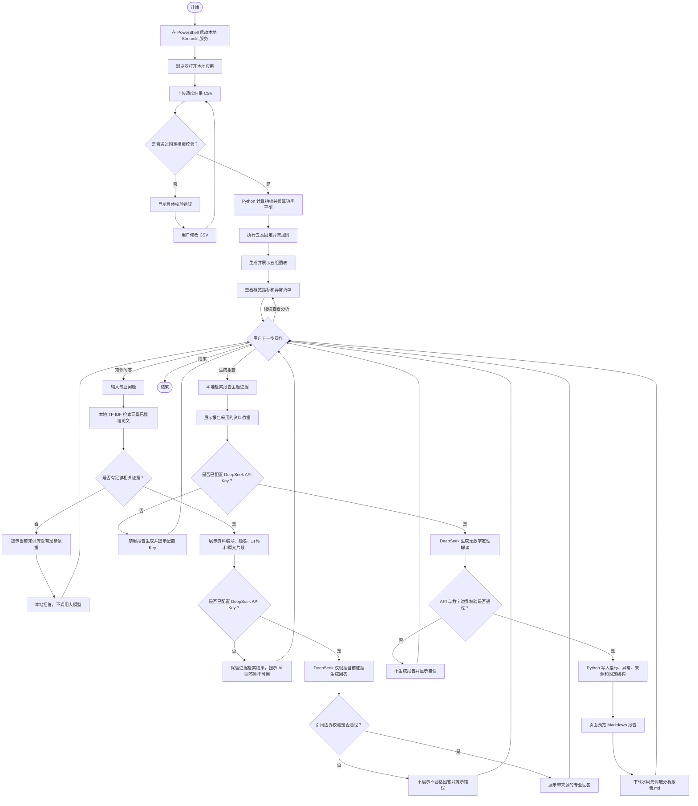

# 水风光调度智能分析助手用户流程图

- 文档版本：V1.0
- 文档日期：2026-08-20
- 适用范围：当前本地 Streamlit MVP

## 1. 总体用户流程



## 2. 主流程简版

```text
启动本地应用
→ 上传调度结果 CSV
→ CSV 固定模板校验
→ Python 计算指标并核算功率平衡
→ 生成图表和异常清单
→ 检索专业论文证据
→ DeepSeek 生成带引用回答
→ Python 与 DeepSeek 协同生成结构化报告
→ 预览并下载 Markdown
```

## 3. 关键节点说明

| 节点 | 执行者 | 说明 |
| --- | --- | --- |
| CSV 校验 | Python | 检查 GBK 编码、12 列、365 行、连续日序号、数值完整性和比例范围 |
| 指标与功率平衡 | Python | 使用固定公式和同一份数据进行确定性计算 |
| 图表与异常 | Python | 输出五组固定图表，按五类透明规则标记异常 |
| 证据检索 | 本地检索模块 | 只从两篇已批准论文返回资料编号、题名、页码和原文片段 |
| 专业回答 | DeepSeek + Python | DeepSeek 组织语言，Python 校验引用必须属于本次检索证据 |
| 报告解读 | DeepSeek | 只生成不含数字的定性文字，不负责计算指标 |
| 报告组装 | Python | 固定写入数字、单位、异常、来源、章节和下载文件 |

## 4. 异常分支与降级结果

| 异常场景 | 系统反馈 | 用户下一步 |
| --- | --- | --- |
| CSV 校验失败 | 显示具体字段、行数、数值或范围错误；停止分析 | 修改文件后重新上传 |
| 未配置 API Key | 本地分析和证据检索仍可使用；AI 回答和报告不可用 | 临时配置 Key 后重新操作，或继续查看本地结果 |
| 没有足够证据 | 明确提示当前知识库依据不足，不调用模型 | 调整问题，或后续经批准补充合法资料 |
| DeepSeek API 失败 | 显示调用错误，保留所有本地分析结果 | 稍后重试，不需要重新计算 CSV |
| 回答无引用或引用越界 | 不展示不合格答案 | 重新发起问答或检查证据范围 |
| 报告解读包含数字或百分号 | 数字边界校验失败，不生成报告 | 重新生成；Python 结果不会被覆盖 |

## 5. 流程边界

- CSV 分析是问答和报告之前的入口，当前产品不是三个互不相关的工具集合。
- 用户可以在分析完成后反复切换“调度分析、知识问答、分析报告”三个标签。
- PowerShell 承载本地服务进程，可以最小化但不能在使用期间关闭；浏览器是操作界面。
- 没有 API Key 时产品仍能完成确定性分析，但不能生成 AI 回答或 AI 报告解读。
- 系统不执行优化求解、重新调度、自动决策推荐或通用 Agent 任务。

